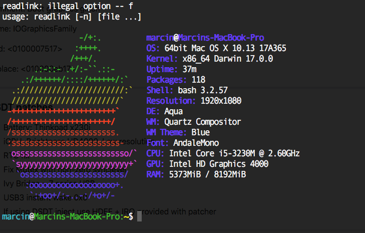

# X230-High-Sierra

Near-perfect High Sierra configuration for Thinkpad X230
Tailored for:
i5-3230m @ 2,6GHz (3,0GHz turbo)
Intel HD 4000
Bluetooth Broadcom 0x0A5C / 0x21E6

In order for Bluetooth to work properly you need to have the switch flipped on before booting - otherwise it says bluetooth is unavailable even after toggling it on with hardware switch.

Mojave is supported for this Thinkpad but I am getting memory error after updating from appstore (End Randomseed) and I am currently working on resolving this issue.

| Feature  | Desc |
| ------------- | ------------- |
| Audio  | Working, although the volume is quite quieter compared to Windows 10 (even after enabling HalfVolumeFix in VoodooHDA |
| GPU  | HD4000 works fine, smooth animations, game performance kinda crappy (League of Legends around 50 fps on lowest at native resolution  |
| USB ports  | All working  |
| CPU Sleep states  | All working, turbo boost works, clocking down works  |
| Battery status  | Working, but I use 3rd party app "Endurance" (should improve battery life a bit, comes with it's own battery indicator  |
| WiFi  | Using USB dongle that doesn't support WPA2-Enterprise (most commonly found in school networks). Ordered a WiFi card mentioned here: https://github.com/Lunarixus/ThinkPadx230Mojave - will update if it works (requires rebranding)  |
| Webcam  | Working  |
| iCloud Services (Facetime, iMessage doesn't work - iCloud drive works)  | Not working (SMBIOS and all stuff inside config.plist configured properly but still getting error (even after talking with the support to unblock them)  |
| Bluetooth  | Working (couple of kexts to enable it and then you need to get proper firmware kext [without it the BT will work but you won't connect any non-apple device like 3rd party BT keyboard] which you can get from here: https://github.com/winterheart/broadcom-bt-firmware (open system report from About this Mac and find vendorID and productID of your Bluetooth card)  |
| VGA  | Macs don't even have this port so you will have to use MiniDP to HDMI/VGA adapter  |
| Cardreader  | Got kext to recognize it although the system freezes when you put any SD Card inside  |
| Sleep  | Goes to sleep although I never actually checked if it really goes to sleep without draining too much battery |
| Keyboard  | All function (except for mic on/off) keys working properly - brightness, volume, mute audio  |
| Intel QuickSync  | Working - for those of you using Final Cut Pro for video editing (can easily edit 4K footage; also exports are faster than on my main PC with Ryzen 5 1600 on Adobe Premiere :) (although when you use DaVinci Resolve on Windows PC it uses more cores and the export times are way faster)  |

Credits to already existing repos:
https://github.com/Bizzaro/x230-osx
https://github.com/xxx10101xxx/ThinkPad-X230-macOS
https://github.com/Lunarixus/ThinkPadx230Mojave (for the WiFi card swap without flashing BIOS)
